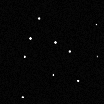
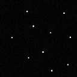

# Task
Here is the output from a CCD Camera from a star tracker, identify as many stars as you can! (in image reference coordinates) Note: The camera prints pixels in the following order (x,y): (0,0), (1,0), (2,0)... (0,1), (1,1), (2,1)…

Note that top left corner is (0,0)

## Solution 
The accepted value to identify a star is 255 and the acctepted coordinates is the centered pixel.

### Star images

